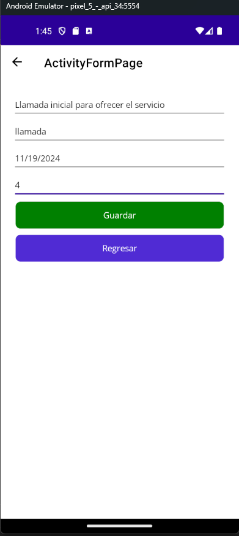
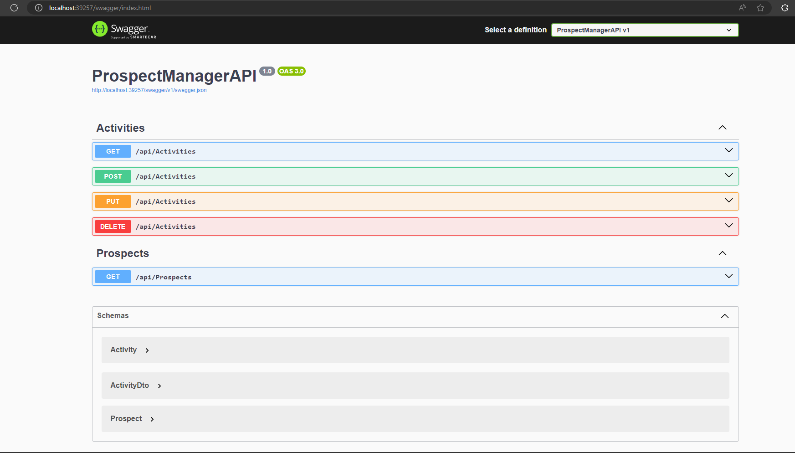

# ProspectManagerNetby
 ProspectManagerNetby

Este repositorio contiene el código fuente y recursos para **ProspectManager**, una solución completa que incluye una API, scripts de base de datos y una aplicación móvil desarrollada con .NET MAUI 8. 

## Estructura de Carpetas

La estructura del proyecto está distribuida de la siguiente manera:

├── API │ └── Proyecto API de ProspectManager ├── DB │ └── Scripts para la creación de la base de datos └── MobileApp └── Proyecto móvil desarrollado en MAUI (.NET 8)

## Pasos para la Ejecución

Sigue los pasos a continuación para poner en marcha el proyecto:

1. **Ejecutar los scripts de base de datos**  
   Ve a la carpeta `DB` y ejecuta los scripts SQL en tu servidor de base de datos.

2. **Verificar la cadena de conexión en el proyecto API**  
   En el proyecto ubicado en la carpeta `API`, edita el archivo de configuración (`appsettings.json`) para asegurarte de que la cadena de conexión apunta a tu base de datos correctamente.

3. **Configurar la URL del API en la aplicación móvil**  
   Abre el proyecto en la carpeta `MobileApp` y localiza el archivo `Service/ApiService`. Asegúrate de que la variable `_url` apunta correctamente al endpoint del API.

---

## Capturas de Pantalla

A continuación, algunas capturas de pantalla representativas del proyecto:

### Aplicación Móvil - Pantalla Prospectos

### Aplicación Móvil - Pantalla Actividades

### Aplicación Móvil - Pantalla Formulario Actividades

### Aplicación Móvil - Pantalla Formulario Actividades Validacion

### API - Swagger

---

## Requisitos del Sistema
Para acceder al swagger colocar al ruta ejemplo http://localhost:39257/swagger

## Requisitos del Sistema

- **Backend**: .NET 7/8
- **Frontend**: MAUI .NET 8
- **Base de Datos**: SQL Server